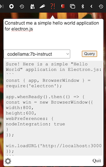

# Dumbar


Dumbar is sort of like a smart bar app, but it's ... dumb.

But seriously, Dumbar is a simple menu bar application that gives you quick access to Ollama and any models you have installed or have created. The goal is to give fast access to LLMs to help you with whatever task you feel you're dumb enough to ask a pseudo-AI for help about.



Dumbar uses the [Ollama](https://ollama.ai) API for any queries to an LLM.

## Requirements

In order to run Dumbar, you must have [Ollama](https://ollama.ai) installed. As of the writing of this README, only Apple Silicon Macs are supported.

### Configuration

There are currently two configuration options for Dumbar:

- Ollama Host - this is typically `127.0.0.1` or `localhost`, but you have the option to override it if needed.
- Ollama Port - typically Ollama runs on port `11434`, but you can override the port as well.

### Troubleshooting

The most common issues are that either Ollama is not running, or you have not yet set up any models for Ollama to use.

You can run `ollama list` in a terminal, and it should give you a list of models installed:

```shell
$ ollama list
NAME                     	SIZE  	MODIFIED
bartender:latest         	7.3 GB	5 weeks ago
chef:latest              	7.3 GB	10 minutes ago
codellama:7b-instruct    	3.8 GB	33 hours ago
codellama:latest         	3.8 GB	33 hours ago
llama2:13b               	7.3 GB	5 weeks ago
llama2:7b                	3.8 GB	12 hours ago
programmer:latest        	3.8 GB	5 minutes ago
```

### Example Modelfiles

Dumbar includes some example Modelfiles that you can use to get started:

- [bartender](examples/bartender.modelfile) - `ollama create bartender -f examples/bartender.modelfile`
- [chef](examples/chef.modelfile) - `ollama create chef -f examples/chef.modelfile`
- [programmer](examples/programmer.modelfile) - `ollama create programmer -f examples/programmer.modelfile`

Each tries to inject a fairly simple prompt to help guide responses from the LLMs.

## Building Locally

Dumbar is an Electron.js app, and requires Node.js in order to run and package.

### Setting Up

You will need to install all packages that are required:

```shell
$ yarn
```

### Running

In order to run locally:

```shell
$ yarn run app
```

This will run Dumbar locally from the checked out source code.

### Packaging

```shell
$ yarn run package
```

Dumbar uses `electron-builder` to prepare and package the application. If you are not familiar with `electron-builder`, you can read documentation at https://electron.build/

When ready to package, you will need to change the `identity` in `build/electron-builder.json` to your own certificate profile, otherwise the package will not be signed. Not being signed is not the end of the world, but other users may have to explicitly allow the installation to take place in their security settings.

Official Dumbar packages are signed for your convenience.
